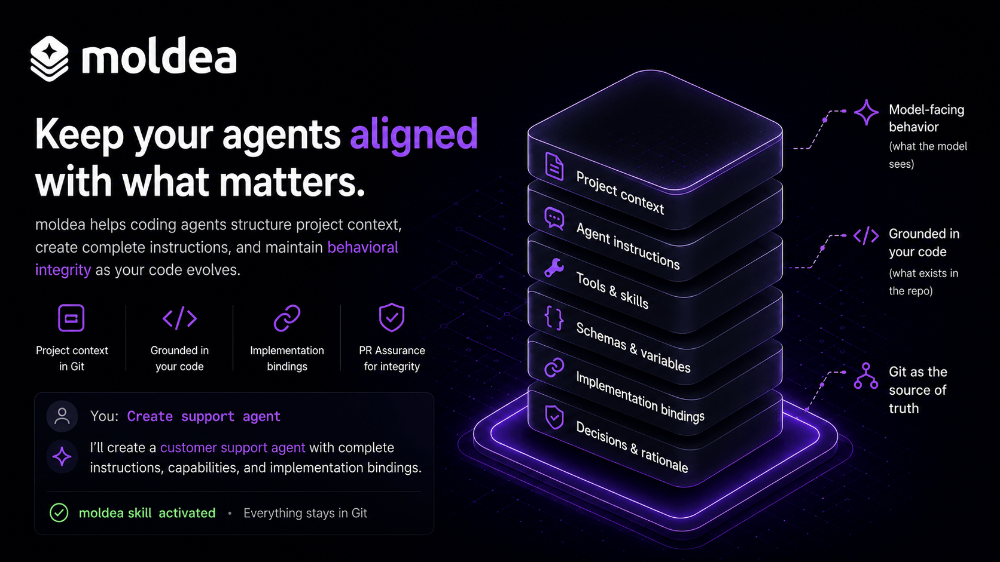

# `moldea` Agent Skill

[Get `moldea` on skills.sh](https://www.skills.sh/moldea-ai/skill/moldea) or explore the complete documentation at [`skill.moldea.ai`](https://skill.moldea.ai).

The current release is `3.1.0`. Install the latest version from `main` in the current project with:

```bash
npx skills add moldea-ai/skill
```

For a reproducible installation, pin the immutable release tag:

```bash
npx skills add "moldea-ai/skill#v3.1.0"
```

Both sources install the portable skill as `moldea`. They do not install `@moldea.ai/cli` globally or require a `moldea` Cloud account.

## What `moldea` is

`moldea` is a Git-native system for project context and agent behavior. A client repository owns its canonical `/moldea/**` state, including project truth, focused context, decisions, runtime guidance, agent instructions, implementation relationships, runtime variables, mirrors, and unresolved requirements.

This Agent Skill is the portable semantic operating layer used by a compatible coding agent to:

- initialize a context-first `moldea` project
- plan the smallest appropriate system of agents, Agent Skills, deterministic software, services or tools, data contracts, and human control for an AI-enabled objective
- continuously maintain affected project, Agent Skill, and agent state as knowledge and implementation evolve
- create and refine grounded agent behavior
- create and refine reusable Agent Skills with focused references, scripts, and assets when they are the right boundary
- evaluate structural and semantic alignment without writing
- reconcile confirmed drift through authorized repository changes
- invoke deterministic repository-local validation

Local work is filesystem-first and private by default. The skill does not send repository content to `moldea` Cloud, and Cloud is not required for installation or local operation.

## Installation

The primary public distribution page is [`moldea` on skills.sh](https://www.skills.sh/moldea-ai/skill/moldea). It provides the current listing and installation path for compatible coding agents.

### Project installation (recommended)

The preferred path uses the open-source [`skills` CLI](https://github.com/vercel-labs/skills). Its default project scope keeps the skill with the repository so the team can share it through version control:

```bash
npx skills add moldea-ai/skill
```

This source follows `main`. To install the current release reproducibly, use its immutable tag:

```bash
npx skills add "moldea-ai/skill#v3.1.0"
```

The `skills` CLI supports Agent Skills-compatible hosts including Codex, Claude Code, Cursor, OpenCode, GitHub Copilot, Cline, and many others. Host detection and installation location are handled by the installer; the portable skill itself remains vendor-neutral.

### Global installation (optional)

Developers who want the latest version from `main` available across all projects can add `-g`:

```bash
npx skills add moldea-ai/skill -g
```

Add `-g` to the release-tag command instead when a reproducible global installation is required.

### Update or remove

Refresh a branch-tracking project installation from `main` with:

```bash
npx skills add moldea-ai/skill
```

Refresh a branch-tracking global installation with:

```bash
npx skills add moldea-ai/skill -g
```

A release-pinned installation remains on its immutable tag. To update it, replace `v3.1.0` in the following command with the desired newer published tag:

```bash
npx skills add "moldea-ai/skill#v3.1.0"
```

Add `-g` to the tagged command only when updating a global installation.

Remove the project installation with:

```bash
npx skills remove moldea
```

Add `-g` to remove the global installation instead.

## Prerequisites

Installing the skill has no `moldea` runtime prerequisite. Using it for deterministic client-repository operations requires:

- Git `>=2.30.0`
- Node.js `^22.11.0 || ^24.11.0`
- an established supported package manager, or npm when none is established
- this skill release's exact repository-local `@moldea.ai/cli` development dependency

Release `3.1.0` supports:

- `@moldea.ai/cli 4.0.1`
- CLI JSON schema `2`
- npm `>=10.9.0 <12.0.0`
- pnpm `>=11.20.0 <12.0.0`
- Yarn `>=4.0.0 <5.0.0`

CLI `4.0.1` is part of this skill release's identity. Another CLI version belongs to another skill release and is not treated as interchangeable.

Write-capable workflows inspect executable package-manager configuration as file data before any package-manager process. A pnpmfile, hook, or Yarn `plugins[].path` declaration counts as executable configuration even when its code remains unread and unrun. Repository-supplied executable configuration blocks manager execution. The report retains every independent blocker even when another clarification also pauses the workflow. It names the exact path, blocked operation, unavailable evidence, and safe prerequisite: remove or disable the extension and retry, or independently verify and invoke an already declared and installed exact local CLI without the manager. It never recommends bypassing or executing the hidden extension merely to continue. For pnpm Plug'n'Play, the coding agent resolves the exact package through `pnpapi`, validates its relative binary and package containment, then invokes that binary through a separate `pnpm node` process. When an accessible repository-specific request asks for local CLI proof, it performs these checks and reports the accepted provider, version, command, and envelope instead of returning only a procedure. Result-dependent safety checks and deterministic CLI commands run as separate processes so each accepted result remains independently attributable. `evaluate` is strictly read-only and reports missing or mismatched tooling instead of installing it. Agent-system `plan` is also read-only and may run before adoption or local tooling exists. The skill never falls back to a global CLI or transient CLI download.

## Quick start

1. From the project root, install the skill.
2. Open a Git repository in a compatible coding agent.
3. Ask your coding agent naturally:

```text
Create support agent
```

The first-use journey is `developer -> coding agent -> moldea skill when relevant -> grounded agent system`. The skill understands the project before inventing behavior, uses existing `moldea` context or establishes the minimum useful foundation when adoption is authorized, then creates or maintains the requested agent system. The developer does not need to initialize `moldea` separately or invoke its local CLI directly.

To establish project context without creating an agent, ask:

```text
Initialize moldea for this repository.
```

Standalone initialization first understands the project, then establishes required local tooling and creates the minimum valid foundation:

```text
/moldea/moldea.yaml
/moldea/project.md
```

It does not create an agent automatically. Additional context, decisions, runtime guidance, agents, or unresolved requirements are created only when project evidence justifies them.

Initialization may become a short clarification conversation. The coding agent classifies high-information project evidence before changing dependency state. Repository names, generic labels, placeholder files, empty exports, and brief or generic package metadata may inform clarification but are not a meaningful foundation by themselves. When evidence does not establish meaningful project context, the coding agent says so and asks a focused foundational question instead of inventing project truth. When a broad consequential claim is supported only by narrower implementation evidence, it reports the narrower conclusion and asks about the unestablished authority, permission, value-bearing, destructive, lifecycle, or external-action boundary. Both outcomes pause before tooling installation, canonical project state, mirrors, or the owned README awareness block, and developer-answerable ambiguity is not stored as an unresolved requirement. A sufficiently grounded repository completes without ceremonial questions, and the final report maps the material sources to the foundation conclusions they established.

After completion, the coding agent summarizes the established foundation, files, and validation, then offers practical options such as reviewing the context, continuing ordinary development, planning an agent system, or creating a specific agent.

To design an AI-enabled system before implementation or `moldea` adoption, ask:

```text
Plan an agent system for personalized ecommerce promotions and decide what should remain ordinary software.
```

Planning starts from the objective and bounded repository discovery across high-information surfaces, a root inventory, and relevant source, documentation, configuration, and tests. Discovery only queues candidate evidence. Before a repository-specific conclusion, absence claim, responsibility allocation, or topology, the coding agent opens every accessible material candidate and maps its path to the fact and responsibility it establishes. The recommendation preserves, combines, or reliably replaces every responsibility. Incompatible private context, permission, trust, or failure boundaries remain separate unless deterministic software replaces one. Repository-established data authority, readers, writers, persistence, model contracts, deterministic enforcement, and approval scope remain explicit. An unresolved authority or topology decision takes priority over downstream configuration questions. If runtime identity is explicitly requested and the exact local CLI is safely available, planning runs `compatibility --json`, treats its inventory only as availability evidence, and leaves runtime selection open without behavioral evidence. Every recommendation includes an implementation sequence. Planning changes no repository, dependency, Git, or external state and does not create a canonical plan artifact.

## Natural-language operations

| Outcome           | Example request                                                             |
| ----------------- | --------------------------------------------------------------------------- |
| Plan a system     | `Plan which parts of this workflow should be agents versus normal code.`    |
| Initialize        | `Initialize moldea for this repository.`                                    |
| Maintain context  | `Update the project context for the new refund policy.`                     |
| Create an agent   | `Create a customer-support agent grounded in the current implementation.`   |
| Maintain an agent | `Add the order lookup tool to the support agent and align its instruction.` |
| Create a skill    | `Create a reusable release-review skill for coding agents.`                 |
| Maintain a skill  | `Update the release-review skill for the current deployment workflow.`      |
| Evaluate          | `Evaluate the current moldea project.`                                      |
| Reconcile         | `Reconcile the billing agent with the implementation.`                      |
| Validate          | `Validate the moldea project.`                                              |

`evaluate` reports deterministic diagnostics, confirmed semantic problems, material ambiguities, relevant unresolved requirements, and evidence limitations without modifying any repository file. Every material runtime unknown names a reliable resolver such as source-owned target documentation, closed wiring, provider configuration, or an integration test; otherwise the evaluation is incomplete. `reconcile` begins from the same evidence model. It corrects established drift but does not let implementation, instructions, validation, or synchronized mirrors choose among unresolved policies.

## Continuous maintenance

Potentially durable project knowledge is the first activation signal once a repository has adopted `moldea`, even when it arrives as a bare answer, table, YAML, JSON, prose, or accessible source with no persistence request. Behavior-affecting work also activates the skill when it changes a path referenced by canonical state or an unresolved requirement. The coding agent checks the canonical manifest, project context, and README marker directly rather than inferring non-adoption from search results. It reconsiders relevant canonical state and persists only material, durable, sufficiently established truth. A material unexplained conflict produces one focused question that distinguishes a current replacement from a proposed or future state before any canonical change. When an explicit correction replaces stale context, the report names both the replaced claim and resulting current truth.

Activation does not mean automatic persistence or documentation churn. A legitimate result is no `/moldea/**` edit when supplied knowledge is transient or unclear, or when established state remains accurate. The coding agent reports which canonical state it reconsidered, explicitly states that no canonical change was required, and explains why. Knowledge- and relevance-triggered activation never initialize an unrelated repository without explicit developer intent, and an explicitly read-only request remains read-only.

A knowledge handoff may load the skill before adoption is known so it can inspect that boundary. Loading alone never establishes adoption or authorizes persistence. In an unadopted repository, the response says the knowledge was not persisted and no files changed.

## Portable skill

The released runtime artifact is:

```text
moldea/
├── SKILL.md
├── references/
│   ├── agent-design.md
│   ├── agent-system-planning.md
│   ├── context-gathering.md
│   ├── continuous-maintenance.md
│   ├── evaluate-and-reconcile.md
│   ├── local-tooling.md
│   └── skill-design.md
└── agents/
    └── openai.yaml
```

`SKILL.md` contains the universal activation, authority, compatibility, operation-selection, and reporting rules. Focused references are loaded only for the workflows that need them, including objective-first agent-system planning and evidence-grounded Agent Skill design. `agents/openai.yaml` is an optional host extension whose presentation and invocation metadata supplements rather than redefines the portable core.

## Project blueprint

- `moldea/` is the complete distributed Agent Skill artifact.
- `docs/` contains concise, durable public concepts, workflows, references, and paired interaction examples. It does not document APIs or HTTP endpoints.
- `website/` is the isolated private Astro application that validates and renders `/docs/**`, passing semantic evidence and complete qualification history under `/evidence/**`, local search, and generated `llms.txt` for [`skill.moldea.ai`](https://skill.moldea.ai). It consumes the public `@moldea.ai/website-ui` package for shared moldea website foundations while retaining its own content, assets, navigation, SEO identity, and theme storage.
- `CNAME` declares `skill.moldea.ai` as the GitHub Pages custom domain.
- `tests/` contains deterministic metadata, packaging, published-package, candidate-release, reference, and semantic-contract checks.
- `tooling/` contains shared development-only Codex evaluation isolation, sourced scenario and repository-control evidence, semantic coverage validation, source and published package-candidate construction, and exact release-identity management.
- `fixtures/` contains development-only conformance cases, the semantic coverage map and committed result, a hostile lifecycle-script fixture, and a narrow synthetic compatibility fixture.
- `qualification/` contains the isolated local adapter-support qualification runner, transparent mock projects, checkpoints, and committed result history.
- `.github/workflows/pages.yml` verifies and deploys the documentation website, then submits its sitemap to Google Search Console after successful push deployments.
- `.github/workflows/conformance.yml` runs portable conformance across supported Node.js lines and representative minimum/latest package-manager versions.
- `.github/workflows/release-candidate.yml` manually packs an exact packages-repository ref and runs the real CLI candidate closure across the same package-manager matrix without publishing it.
- `README.md` documents public installation, adoption, development, and release behavior.

Development-only tests and fixtures are not required runtime inputs and are not included by the direct `moldea/` installation target.

## Development

Run the portable skill and conformance correctness checks:

```bash
npm test
```

Run the categories separately:

```bash
npm run test:unit
npm run test:integration
```

Keep the current release bound to one published CLI version with:

```bash
npm run release:update-cli -- <exact-version>
npm run release:identity:check
```

The updater verifies a stable public npm release, updates the exact root dependency and lockfile, synchronizes the portable compatibility contract and conformance fixtures, and records the CLI's complete internal dependency inventory in the synthetic semantic fixture. `npm run release:check` is the final local gate: it runs deterministic verification and additionally requires fresh passing semantic and qualification evidence. It is expected to fail while a release candidate deliberately has no model evidence.

Release evidence must be generated from the committed source that will be tagged. First commit the completed skill, qualification suite, profile, and release identity. Then run and record the complete semantic evaluation, run the Custom qualification, and run each adapter profile only after the exact compatible Custom baseline exists. Inspect and commit every generated result, run `npm run release:check` on that final tree, and tag only after the gate passes. The gate rejects a stale semantic artifact, an incomplete qualification profile, missing or non-passing stages and cases, a package checkout commit or fingerprint mismatch, a behavior-bearing target mismatch, an incomplete or mismatched published package closure, dirty-source evidence, incomplete claim coverage, or an adapter attempt that does not reference the current passing Custom baseline.

Adapter qualification is a separate local workflow and is not included in `npm test` or CI. Install its isolated dependency closure with `npm --prefix qualification ci --ignore-scripts`, then use:

```bash
npm run qualification
npm run qualification:dry-run
npm run qualification:list
npm run qualification:test
npm run qualification:typecheck
npm run qualification:lint
npm run qualification:format:check
npm run qualification:verify
```

The runner reads the canonical compatibility matrix from the adjacent packages repository at `../packages` by default; explicit runs can select another checkout with `--packages-repository /absolute/path/to/packages`. It resolves the root release's exact published CLI, selected adapter closure, profile-owned runtime packages, and qualification-owned TypeScript compiler from npm, then verifies registry SHA-512 and SHA-1 identities plus downloaded SHA-256 digests. It installs the portable skill through `.agents/skills/moldea` and uses the project-local CLI, runtime packages, and compiler in every project. Paid actor and judge stages always use the fixed balanced-tier model at `medium` reasoning effort (`gpt-5.6-terra`). Both roles use the shared Bubblewrap host in separate workspaces, with the judge workspace mounted read-only. Official runs require clean package, complete qualification-engine, and portable-skill inputs plus the fixed model transport, TLS trust, and egress boundary; violations are recorded as a failed preflight before any paid stage. Paid confirmation occurs only after free preparation and cache lookup, immediately before the first uncached model call. See the [adapter qualification guide](qualification/README.md) for profiles, transparent projects, checkpoint recovery, caching, and public result artifacts.

The documentation website uses an isolated Node.js 24.15.0 dependency boundary and exact `@moldea.ai/website-ui` package release. Install its exact dependency closure with `npm --prefix website ci --ignore-scripts`, then use:

```bash
npm run docs:check
npm run website:check
npm --prefix website run test:e2e
```

Run the local website with:

```bash
npm run website:dev
```

The static build defaults to `SITE_URL=https://skill.moldea.ai` and `BASE_PATH=/`. The build derives documentation routes, the `/evidence/**` hierarchy, qualification profile and attempt routes, navigation, local search, and public `llms.txt` from repository-owned sources. It fails when semantic evidence is missing, stale, incomplete, or non-passing, or when qualification history or its latest and last-passing pointers are invalid. The separate release gate still requires current passing qualification evidence. Generated model output is ignored and must not be edited directly.

The Pages deployment reads the repository's configured host and base path, builds for that canonical HTTPS origin, and publishes through GitHub's official Pages artifact flow. Keep the GitHub Pages custom-domain setting and DNS record aligned with `CNAME`; the canonical production origin is [`https://skill.moldea.ai`](https://skill.moldea.ai). After a successful push deployment, the workflow submits `https://skill.moldea.ai/sitemap-index.xml` to the `sc-domain:moldea.ai` Google Search Console property.

Search Console submission requires the `GOOGLE_SEARCH_CONSOLE_CREDENTIALS` Actions secret, configured at the `moldea-ai` organization level with this repository in its selected-repository policy. The secret contains the JSON key for `moldea-sitemap-submitter@moldea-prod.iam.gserviceaccount.com`, which must remain an owner of the Search Console property and retain `Service Account Token Creator` on itself. Manual workflow dispatches deploy the selected ref but do not submit its sitemap. A submission failure is reported after deployment and does not roll back the published Pages artifact.

The complete integration suite requires Bubblewrap and derives the published CLI version from the root exact dependency. Portable CI jobs provision Bubblewrap, load Ubuntu's packaged Bubblewrap AppArmor profile, and run the complete suite. The package-manager matrices run the focused package-manager integration boundary across npm `10.9.0` and `11.19.0`, pnpm `11.20.0` and `11.21.0`, and Yarn `4.0.0` and `4.18.0` against that one release CLI without repeating unrelated sandbox checks. The independent release-candidate workflow can exercise a newly packed exact CLI before the skill adopts it. Yarn versions with a minimum-release-age gate use their command-scoped override only inside the isolated conformance install so newly published exact package versions remain testable.

The ordinary package-manager integration suite first serves the adversarial lifecycle fixture through an isolated local registry with faithful package metadata. That fixture intentionally contains lifecycle scripts and remains the security proof for exact pinning and lifecycle suppression. A separate mandatory path installs the selected exact published CLI from npm, proves local executable provenance, and executes deterministic `compatibility --json` and `inspect --json` checks against a custom-runtime project.

When `MOLDEA_CLI_ARTIFACT_DIRECTORY` identifies a packed candidate closure rooted at `@moldea.ai/cli`, the same suite derives package identities, versions, and internal dependency composition from the packed manifests. It rejects missing, duplicate, unreachable, mismatched, and non-exact CLI dependencies before building a scoped loopback registry and running the shared real-CLI checks. Set `MOLDEA_REQUIRE_REAL_CLI_ARTIFACTS=1` at the release boundary so a missing artifact directory fails instead of skipping that candidate-only case. The manual Release Candidate workflow accepts an exact `moldea-ai/packages` ref, records the resolved commit, discovers the current source package graph, builds local build dependencies in dependency-first order, packs the complete reachable runtime closure, and runs this path across every supported package-manager version without publishing or tagging either repository.

`fixtures/conformance-cases.json` contains package-manager, CLI-envelope, README-marker, planning, Agent Skill, runtime, security, and semantic forward-evaluation scenarios. Deterministic tests execute the mechanical decisions and validate every semantic case's evidence, requested operation, expected outcomes, and forbidden outcomes. CI also installs the portable artifact into an isolated Agent Skills home and compares the installed tree byte-for-byte with `moldea/`.

Semantic evaluation is intentionally lengthy and can consume a significant number of model tokens because every case runs separate actor and judge processes. The current full suite contains 48 cases and can make up to 96 model calls. Its runtime-selection cases treat the compact CLI inventory only as adapter availability and require separate reliable evidence for behavioral support. Do not start a full or targeted semantic evaluation without first explaining to the developer why fresh semantic evidence is important for the current change, why existing evidence or deterministic verification is insufficient, and the expected time and token cost when known. Obtain the developer's explicit approval before running it.

Semantic behavior is evaluated through an Agent Skills-capable host and recorded against the exact portable artifact digest. Before any model execution, validate the complete coverage and scenario boundary for free:

```bash
npm run eval:semantic:preflight
```

The preflight materializes all 48 repositories, verifies every sourced evidence declaration, confirms each actor prompt is exactly the natural developer direction, and proves that evidence collection preserves protected repository controls. The runner always pins both the actor and judge to a balanced-tier model at `medium` reasoning effort (`gpt-5.6-terra`); caller-provided host commands must not select their own model or reasoning effort. This fixed configuration avoids per-run model and effort decisions. To refresh the paid evidence after preflight, provide a non-interactive host command that accepts the evaluation prompt on standard input and returns Codex JSONL events, then run:

```bash
MOLDEA_EVAL_ACTOR_COMMAND_JSON='["codex","exec","--ignore-user-config","--ignore-rules","--ephemeral","--skip-git-repo-check","--dangerously-bypass-approvals-and-sandbox","-c","shell_environment_policy.inherit=none","-"]' npm run eval:semantic -- --record
```

Recording writes `fixtures/.semantic-evaluation-candidate.json` atomically after every completed case. The candidate is ignored by Git and is bound to semantic protocol `12`, result schema `2`, the exact portable artifact digest, release CLI version and registry integrity, package-lock digest, complete semantic case-suite digest, semantic coverage digest, and actor and judge identities, including their fixed model and selected reasoning effort. Repeating the same full command resumes a compatible candidate: already passing cases are skipped, while missing and failing cases are evaluated again. The isolated host closes active relay tunnels after every success, failure, timeout, or cancellation, allows five seconds for graceful exit, and kills only its exact relay child if necessary. If any bound input changes, including the semantic evaluation protocol version or coverage contract, the runner rejects the candidate instead of mixing evidence; after confirming that the old evidence should be discarded, start a fresh full candidate with `--record --restart`.

After an approved full run leaves only a small number of failing or interrupted cases, rerun one case into the same candidate with:

```bash
MOLDEA_EVAL_ACTOR_COMMAND_JSON='["codex","exec","--ignore-user-config","--ignore-rules","--ephemeral","--skip-git-repo-check","--dangerously-bypass-approvals-and-sandbox","-c","shell_environment_policy.inherit=none","-"]' npm run eval:semantic -- --case <case-id> --record
```

A targeted recorded rerun replaces only that case's compatible candidate evidence. The runner promotes the candidate atomically to `fixtures/semantic-evaluation-result.json` and removes the candidate only after every required case passes. Missing or failing evidence never replaces the committed result.

The runner uses the shared development host under `tooling/codex-evaluation-host/`, which validates the Codex command and requires Bubblewrap and `socat` before execution. Bubblewrap builds an empty filesystem root from a minimal set of read-only runtime paths, creates fresh process, IPC, network, cgroup, device, and temporary-filesystem boundaries, drops capabilities, and exposes only a fresh evaluation repository plus copied authentication state as writable. It does not mount host runtime or socket directories. Codex runs in its documented externally sandboxed automation mode because this machine's kernel cannot create a nested user namespace; the flag never runs outside Bubblewrap. Generated shells inherit none of the host environment, and sessions are not persisted.

The isolated network namespace has no direct host or internet route. A repository-external CONNECT relay permits only HTTPS port `443`, exact configured hostnames, and DNS results containing exclusively public addresses. The default allowlist is `api.openai.com`, `auth.openai.com`, and `chatgpt.com`; add an exact model endpoint with `MOLDEA_EVAL_ALLOWED_HOSTS` when required. Localhost, private, link-local, and undeclared destinations remain inaccessible. Each actor or judge process is killed after five minutes by default; set a positive `MOLDEA_EVAL_HOST_TIMEOUT_MS` only when a deliberate evaluation requires a different bound.

The runner installs the exact portable tree into a fresh project for every actor case. The actor receives only `input.developerDirection`, exactly as a developer could naturally write it. That direction identifies any required related repository, requested artifact location, or product-specific surface instead of relying on evaluator-only knowledge. The evaluator-only scenario, requested operation, sourced repository evidence, labels, and criterion descriptions are withheld. Before actor execution, the runner materializes and records each declared developer-direction, host-instruction, Git-state, workspace-path, or related-repository source. It captures hashes and bounded text content for repository-visible changes and starts a separate judge process in another read-only workspace.

Bubblewrap keeps the ordinary actor working tree writable while overlaying `.git` and `.agents/skills/moldea` read-only. The runner records Git metadata, HEAD, refs, staged state, local configuration, and the installed skill before and after execution. Any repository-control violation forces the case to fail regardless of the judge assessment. Every committed semantic expectation and prohibition pairs a stable evidence label with an explicit evaluator-only criterion. Skill-focused cases also declare evaluator-only artifact roots and activation scenarios. The judge receives the criteria, pre-actor sourced evidence, repository-control evidence, bounded workspace changes, independent structural and resource-link evidence, and positive or adjacent non-activation requests. Content-level outcomes therefore do not rely on opaque labels, the actor's report alone, or leaked answer criteria. The runner consumes Codex JSONL events and supplies bounded command and tool-call events to the judge and persisted result as runner-owned execution evidence. An actor's final response cannot create or replace that evidence.

Scenario-specific package-manager cases may also receive evaluator-owned, non-installing probes mounted read-only over the isolated actor executable directory. The actor cannot replace those probes. They emit the supported manager's inspection shape, keep permitted inspection read-only, reject executable or installation paths outside the scenario contract, and leave repository-visible evidence if a prohibited CLI invocation occurs. They test the actor's decision under controlled conflicting evidence; the real package-manager integration matrix remains the authority for actual installation, resolution, and execution behavior. Ordinary adopted-project cases, including compatibility-sensitive runtime cases, receive a copied, locked production closure from the root exact published `@moldea.ai/cli` dependency without running a package manager. Set `MOLDEA_EVAL_JUDGE_COMMAND_JSON` to use a different safely configured Codex judge command; otherwise the actor command is reused in a fresh process and workspace. See [Semantic evaluation](docs/semantic-evaluation.md) for the public methodology and the role of the committed coverage map.

Use `--case <case-id>` without `--record` for a standalone diagnostic that must not update candidate or committed evidence. A targeted run with `--record` requires an existing compatible candidate and cannot promote it until the complete case suite passes.

The sandbox exposes the exact host Node.js executable at `/opt/node` so the verified repository-local CLI can run without mounting a host-managed runtime directory. It provides a non-installing npm probe that reports the fixed evaluation npm version and rejects every non-version command. It also resolves and mounts the exact `codex-code-mode-host` executable shipped beside the selected Codex binary rather than exposing the surrounding installation directory. The committed result records the actor and judge CLI versions and the runner-owned balanced-tier model configuration: `gpt-5.6-terra` at `medium` reasoning effort.

The result is invalidated automatically whenever semantic distributed skill content changes. A release-only update may carry forward the latest passing result without repeating model execution only when the exact source artifact digest still matches that result, the changed portable paths are limited to `SKILL.md` and `references/local-tooling.md`, and their deterministic semantic digests remain identical after normalizing only the release-version declarations. The fixture records both exact artifact digests, both semantic digests, the changed paths, reason, and carry-forward time. Development evaluation uses synthetic repository evidence and does not require a `moldea` Cloud account.

The root `AGENTS.md` is an intentional maintainer-only symlink to a sibling coding-instructions checkout. It is not part of the portable `moldea/` artifact and the skill has no runtime dependency on it. External contributors may use their own applicable coding instructions when that sibling checkout is unavailable.

## Releases

The skill uses independent semantic versioning. Every release must:

- record its exact version in `moldea/SKILL.md` metadata
- pass conformance on the release commit
- use an immutable `v<version>` tag
- preserve semantically identical `moldea/` content across every official distribution channel

Release `3.1.0` will use the immutable `v3.1.0` tag.

## License

[MIT](LICENSE)
